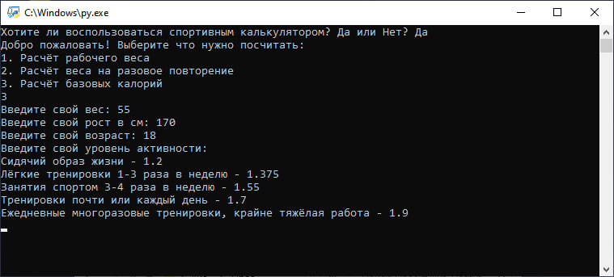

# Sport Calc - Спортивный калькулятор

## Описание
Sport Calc - это программа для расчёта различных спортивных показателей, включая рабочий вес, одно-повторный максимум и базовые калории. Программа использует научно обоснованные формулы для предоставления приблизительных значений.

## Функционал
1. **Расчёт рабочего веса**  
   Программа вычисляет прогнозируемый рабочий вес на основе одно-повторного максимума и желаемого количества повторений, используя формулы:
   - Бжицки
   - Эйпли
   - Ландера

2. **Расчёт одно-повторного максимума**  
   Программа определяет одно-повторный максимум на основе рабочего веса и количества повторений, используя формулы:
   - Брэнда
   - Эйпли
   - Ломберга

3. **Расчёт базовых калорий**  
   Программа рассчитывает суточную норму калорий для поддержания, набора или сброса веса, учитывая:
   - Пол
   - Вес
   - Рост
   - Возраст
   - Уровень активности  
   Используемые формулы:
   - Миффлин-Сан Жеора
   - Харрис-Бенедикта

## Как использовать
1. Запустите программу `Sport Calc.py`.
2. Введите "да" для начала работы с калькулятором.
3. Выберите нужный раздел:
   - `1` для расчёта рабочего веса.
   - `2` для расчёта одно-повторного максимума.
   - `3` для расчёта базовых калорий.
4. Следуйте инструкциям на экране, вводя запрашиваемые данные.
5. Программа выведет результаты с пояснениями.

## Примечание
- Все формулы предоставляют приблизительные значения и могут не отражать точные данные для каждого индивидуального случая.
- Для получения более точных результатов рекомендуется консультация с профессиональным тренером или диетологом.

## Пример использования
